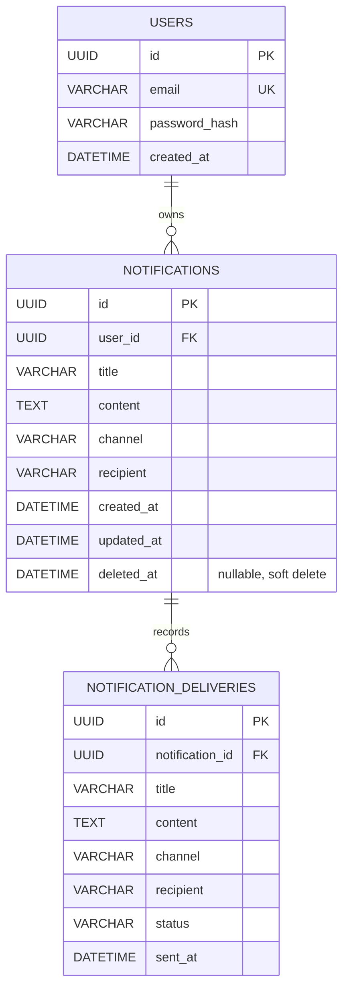

# Diagramas de la solución

Los diagramas usan Mermaid y pueden visualizarse en un visor compatible con Mermaid, como GitHub o la vista previa de Markdown de VS Code.

## Diagrama de base de datos

Una notificación pertenece a un usuario y puede tener varias entregas registradas. El borrado de una notificación es lógico: se establece `deleted_at` y la fila permanece en la base de datos. Las entregas conservan una copia de los datos enviados y el resultado de cada envío.

## Diagrama de clases

```mermaid
classDiagram
    direction TB

    class AuthController {
        +login(login_data) TokenResponse
    }
    class AuthService {
        +login(login_data) TokenResponse
    }
    class AuthDependency {
        +get_current_user(credentials, db) UserModel
    }
    class UserController {
        +register_user(user_data) UserModel
        +get_user_by_id(user_id) UserModel
        +get_user_by_email(email) UserModel
        +get_all_users() list~UserModel~
        +get_my_profile() UserModel
    }
    class UserService {
        +register_user(user_data) UserModel
        +get_user_by_id(user_id) UserModel
        +get_user_by_email(email) UserModel
        +get_all_users() list~UserModel~
    }
    class UserRepository {
        +save(user) UserModel
        +find_by_id(user_id) UserModel
        +find_by_email(email) UserModel
        +find_all() list~UserModel~
    }
    class UserModel {
        +UUID id
        +str email
        +str password_hash
        +datetime created_at
    }

    class NotificationController {
        +create_notification(data, current_user) NotificationModel
        +get_my_notifications(current_user) list~NotificationModel~
        +get_notification_by_id(id, current_user) NotificationModel
        +update_notification(id, data, current_user) NotificationModel
        +delete_notification(id, current_user) None
    }
    class NotificationService {
        +create_notification(user_id, data) NotificationModel
        +get_notification_by_id(id, user_id) NotificationModel
        +get_all_notifications(user_id) list~NotificationModel~
        +update_notification(id, user_id, data) NotificationModel
        +delete_notification(id, user_id) None
    }
    class NotificationRepository {
        +save(notification) NotificationModel
        +find_by_id_and_user_id(id, user_id) NotificationModel
        +find_all_by_user_id(user_id) list~NotificationModel~
        +update(notification) NotificationModel
        +delete(notification) None
    }
    class NotificationModel {
        +UUID id
        +UUID user_id
        +str title
        +str content
        +str channel
        +str recipient
        +datetime created_at
        +datetime updated_at
        +datetime deleted_at
    }
    class NotificationDeliveryRepository {
        +save(delivery) NotificationDeliveryModel
    }
    class NotificationDeliveryModel {
        +UUID id
        +UUID notification_id
        +str title
        +str content
        +str channel
        +str recipient
        +str status
        +datetime sent_at
    }

    class NotificationChannel {
        <<enumeration>>
        EMAIL
        SMS
        PUSH
    }
    class NotificationStrategy {
        <<interface>>
        +validate_recipient(recipient) None
        +send(recipient, title, content) DeliveryResult
    }
    class EmailNotificationStrategy {
        +validate_recipient(recipient) None
        +send(recipient, title, content) DeliveryResult
    }
    class SmsNotificationStrategy {
        +validate_recipient(recipient) None
        +send(recipient, title, content) DeliveryResult
    }
    class PushNotificationStrategy {
        +validate_recipient(recipient) None
        +send(recipient, title, content) DeliveryResult
    }
    class NotificationStrategyFactory {
        +get_strategy(channel) NotificationStrategy
    }
    class DeliveryResult {
        +str status
        +datetime sent_at
    }

    AuthController --> AuthService : delegates
    AuthService --> UserRepository : looks up user
    AuthDependency --> UserRepository : resolves current user
    UserController --> UserService : delegates
    UserController ..> AuthDependency : protects profile
    UserService --> UserRepository : uses
    UserRepository ..> UserModel : persists

    NotificationController --> NotificationService : delegates
    NotificationController ..> AuthDependency : protects endpoints
    NotificationService --> NotificationRepository : persists notifications
    NotificationService --> NotificationDeliveryRepository : persists delivery history
    NotificationRepository ..> NotificationModel : persists
    NotificationDeliveryRepository ..> NotificationDeliveryModel : persists
    UserModel "1" --> "0..*" NotificationModel : owns
    NotificationModel "1" --> "0..*" NotificationDeliveryModel : has history
    NotificationService ..> NotificationChannel : selects channel
    NotificationService --> NotificationStrategyFactory : requests strategy
    NotificationStrategyFactory o-- NotificationStrategy : provides
    EmailNotificationStrategy ..|> NotificationStrategy
    SmsNotificationStrategy ..|> NotificationStrategy
    PushNotificationStrategy ..|> NotificationStrategy
    NotificationStrategy ..> DeliveryResult : returns
```

En el patrón Strategy, `NotificationService` obtiene del factory una estrategia según el canal. Cada estrategia valida el destinatario y ejecuta el envío; el servicio guarda el resultado devuelto junto con la entrega. Para añadir un canal, se implementa `NotificationStrategy` y se registra su instancia en `NotificationStrategyFactory`.